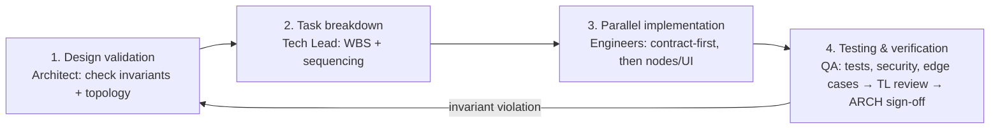

# DalalStreet-Agent — AI Engineering Team & Orchestration Index

> **Root context file for any AI coding assistant working in this repository.** Read this first. It defines the team, the reusable skills, the workflows, and the execution protocol. Every implementation decision must trace back to the constraints declared here and to the canonical project spec.

---

## 1. What this project is

**DalalStreet-Agent** is an autonomous, multi-agent financial-auditing engine for the Indian capital markets (NSE & BSE). It ingests corporate Annual Reports (PDFs), retrieves real-time equity fundamentals over the Model Context Protocol, orchestrates specialized sub-agents with a LangGraph state machine, and runs a self-correcting **Critic/Auditor** loop to flag contradictions between qualitative management claims and quantitative reality.

**The pipeline is 100% zero-cost:** Google Gemini 1.5 Flash (free tier) · local `sentence-transformers/all-MiniLM-L6-v2` CPU embeddings · embedded persistent ChromaDB.

---

## 2. Single source of truth

Context is layered. When they conflict, higher wins:

1. **This file** (`/.claude/CLAUDE.md`) — team, protocol, non-negotiable invariants.
2. **Project spec** — [`.devin/tasks/dalalstreet-agent.md`](../.devin/tasks/dalalstreet-agent.md): architecture, structure, state schema, dependencies, commands.
3. **Reference implementation** — [`plan_by_gemini/`](../plan_by_gemini/): the Gemini-authored HLD + reference code. Treat as **reference, not gospel** — the Architect may override it.

> If a `PROJECT_SPEC.md` or `.gemini/` directory is later added at the repo root, fold it in at layer 2 as additional canonical context.

---

## 3. The engineering team (sub-agents)

Role-based personas. Each file defines scope, identity, I/O contracts, and rules of engagement.

| Agent | Owns | File |
| --- | --- | --- |
| Principal Architect | Topology, invariants, cost/protocol enforcement | [agents/principal-architect.md](agents/principal-architect.md) |
| Tech Lead | Task breakdown, sequencing, review & merge gate | [agents/tech-lead.md](agents/tech-lead.md) |
| GenAI / Agentic Engineer | `graph.py` — StateGraph, reflection loop, Gemini async | [agents/genai-agentic-engineer.md](agents/genai-agentic-engineer.md) |
| Backend Engineer | FastAPI, Pydantic v2, SSE, FastMCP server, RAG store | [agents/backend-engineer.md](agents/backend-engineer.md) |
| Prompt & Eval Engineer | Prompts, strict JSON, grounding, auditor rubric | [agents/prompt-eval-engineer.md](agents/prompt-eval-engineer.md) |
| Frontend Engineer | Streamlit dashboard, SSE consumption, audit viz | [agents/frontend-engineer.md](agents/frontend-engineer.md) |
| QA & Security Engineer | Pytest, resilience, secret hygiene, edge cases | [agents/qa-security-engineer.md](agents/qa-security-engineer.md) |

---

## 4. The skill handbooks

Production handbooks with rules, patterns, anti-patterns, and copy-ready code. Consult the relevant one **before** writing code in that area.

| Skill | Use when working on | File |
| --- | --- | --- |
| LangGraph State Design | `state.py`, reducers, edges, cycle safety | [skills/langgraph-state-design.md](skills/langgraph-state-design.md) |
| FastMCP Tool Contracts | `stock_service.py`, MCP client, yfinance | [skills/fastmcp-tool-contracts.md](skills/fastmcp-tool-contracts.md) |
| ChromaDB Hybrid RAG | `vector_store.py`, PDF ingestion, retrieval | [skills/chromadb-hybrid-rag.md](skills/chromadb-hybrid-rag.md) |
| Clean Architecture (Python) | any module — layering, typing, async | [skills/clean-architecture-python.md](skills/clean-architecture-python.md) |
| SSE Streaming Protocols | the streaming endpoint, frame format | [skills/sse-streaming-protocols.md](skills/sse-streaming-protocols.md) |
| Secure API Key Handling | config, secrets, quota | [skills/secure-api-key-handling.md](skills/secure-api-key-handling.md) |

---

## 5. The workflows

| Workflow | Purpose | File |
| --- | --- | --- |
| Delegation Matrix (RACI) | who owns / does / reviews each deliverable | [workflows/delegation-matrix.md](workflows/delegation-matrix.md) |
| Implementation Runbook | env → ingest → MCP → API → frontend, step by step | [workflows/implementation-runbook.md](workflows/implementation-runbook.md) |

---

## 6. Non-negotiable invariants

Enforced by the Architect; violating any is a rejectable defect.

1. **Zero cost.** Gemini 1.5 Flash (free tier) + local MiniLM + local ChromaDB only. No paid/hosted embeddings or vector DBs, no non-Gemini LLM.
2. **MCP compliance.** All market data via a FastMCP `stdio` server. No direct `yfinance` in graph nodes.
3. **Bounded cycles.** Critic retry loop hard-capped: `iteration_count >= 2 → PASS`.
4. **Deterministic state reduction.** Concurrent writes merge via declared reducers — `rag_context` (`operator.add`), `market_data` (`operator.or_`). Nodes return partial state only.
5. **Layer isolation.** API ▸ Orchestration ▸ Tools ▸ Storage; dependencies point inward, no reach-around.
6. **Async everywhere.** No blocking I/O on the request path; Pydantic v2 only.
7. **Secret hygiene.** Secrets only via env/`settings`; never logged, serialised into SSE, or committed.

---

## 7. System topology (the graph)

```text
START → planner → ┬─ rag_worker ─┐
                  └─ market_worker┘→ critic → {NEEDS_RETRY & <2 → rag_worker | else → synthesizer} → END
```

Five stages: **Planner** (decompose query) → **RAG Worker** ∥ **Market Worker** (parallel retrieval) → **Critic/Auditor** (reconcile, verdict, bounded retry) → **Synthesizer** (structured memo). Fan-out from planner, fan-in to critic (hence the reducers).

---

## 8. Execution protocol

Every feature follows these four phases in order:



1. **Design validation** — Architect confirms the change respects all seven invariants and the 5-stage topology. Record an ADR if topology/layering/dependencies change.
2. **Task breakdown** — Tech Lead produces a WBS with owners, dependencies, and a `done-when` per task. **Contracts land first** (`state.py`, config, MCP signatures, prompt schemas).
3. **Parallel implementation** — engineers build to their contracts; independent nodes/modules proceed in parallel per the [Delegation Matrix](workflows/delegation-matrix.md).
4. **Testing & verification** — QA runs unit + integration + security + the edge-case matrix; Tech Lead reviews and merges; Architect signs off at the invariant gate.

---

## 9. Quick start

New here? Read in this order: this file → the project spec (`.devin/tasks/dalalstreet-agent.md`) → the [Implementation Runbook](workflows/implementation-runbook.md) → the skill handbook for the area you're touching → the owning agent's persona file. Then implement contract-first and verify against the invariants above.
