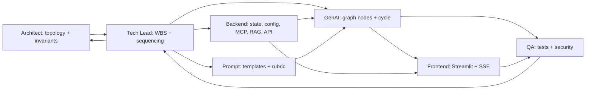

# Workflow: Delegation Matrix (RACI)

> How work flows between the Architect, Tech Lead, and engineers. **R**esponsible = does the work · **A**ccountable = owns the outcome (one per row) · **C**onsulted = gives input · **I**nformed = kept in the loop.

---

## 1. Team key

| Code | Agent | File |
| --- | --- | --- |
| ARCH | Principal Architect | [agents/principal-architect.md](../agents/principal-architect.md) |
| TL | Tech Lead | [agents/tech-lead.md](../agents/tech-lead.md) |
| GEN | GenAI / Agentic Engineer | [agents/genai-agentic-engineer.md](../agents/genai-agentic-engineer.md) |
| BE | Backend Engineer | [agents/backend-engineer.md](../agents/backend-engineer.md) |
| PE | Prompt & Eval Engineer | [agents/prompt-eval-engineer.md](../agents/prompt-eval-engineer.md) |
| FE | Frontend Engineer | [agents/frontend-engineer.md](../agents/frontend-engineer.md) |
| QA | QA & Security Engineer | [agents/qa-security-engineer.md](../agents/qa-security-engineer.md) |

---

## 2. RACI by deliverable

| Deliverable | ARCH | TL | GEN | BE | PE | FE | QA |
| --- | :--: | :--: | :--: | :--: | :--: | :--: | :--: |
| System topology & invariants | **A/R** | C | C | C | I | I | I |
| Dependency approval (`requirements.txt`) | **A/R** | C | I | R | I | I | C |
| Task breakdown & sequencing (WBS) | C | **A/R** | C | C | C | C | C |
| `core/state.py` (`AgentState` contract) | C | A | C | **R** | I | I | C |
| `core/config.py` (settings, secrets) | C | A | I | **R** | I | I | C |
| `graph.py` (nodes, edges, cycle logic) | C | A | **R** | I | C | I | C |
| Prompt templates & JSON schemas | I | A | C | I | **R** | I | C |
| Critic/Auditor rubric | C | A | C | I | **R** | I | C |
| `mcp_server/stock_service.py` (FastMCP tools) | C | A | C | **R** | I | I | C |
| `rag/vector_store.py` (Chroma + PyMuPDF) | C | A | C | **R** | I | I | C |
| `api/**` + SSE endpoint | C | A | C | **R** | I | C | C |
| `main.py` (bootstrap, CORS) | I | A | I | **R** | I | I | I |
| `frontend/app.py` (Streamlit + SSE client) | I | A | I | C | I | **R** | C |
| Test suites (`tests/**`) | I | A | C | C | C | C | **R** |
| Security / secret-leak review | C | A | I | C | I | I | **R** |
| Edge-case matrix & resilience | I | A | C | C | C | C | **R** |
| Code review & merge gate | C | **A/R** | C | C | C | C | C |
| Final acceptance / release | **A** | R | I | I | I | I | R |

> Exactly one **A** per row. If two agents both think they own a decision, escalate to the Architect.

---

## 3. Hand-off flow

### Contract-first ordering (what unblocks what)
1. **ARCH** ratifies topology + invariants.
2. **TL** produces the WBS; assigns owners.
3. **BE** lands the contracts first: `state.py`, `config.py`, MCP tool signatures, `vector_store.py`.
4. **PE** delivers prompt templates + JSON schemas (parallel with BE).
5. **GEN** wires `graph.py` once state + MCP + prompts exist.
6. **BE** exposes the SSE endpoint over `compiled_graph`.
7. **FE** consumes the SSE contract.
8. **QA** tests every boundary; runs the security + edge-case matrix.
9. **TL** reviews and merges; **ARCH** signs off at the invariant gate.

---

## 4. Escalation rules

- **Ambiguous design** → GEN/BE/PE raise to **TL**; TL raises to **ARCH** if it touches topology/cost/protocol.
- **Invariant conflict** (cost, MCP, cycle bound, reducers, layering) → straight to **ARCH**, who has veto.
- **Contract drift** (an `AgentState` key changes) → **TL** blocks the merge until all consumers are updated.
- **Security finding** → **QA** blocks release regardless of feature pressure.

---

## 5. Definition of Done (per task)

A task is done only when: code merged behind TL review · matching test green (QA) · no invariant violated (ARCH) · no secret leak (QA) · its WBS `done-when` line is objectively satisfied.
